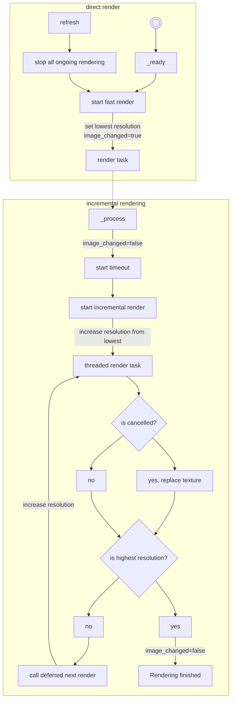

# godot-infinite-worldmap - A Procedural World Map Generator and Viewer Component

## Overview

The Procedural World Map Generator and Viewer Component is a tool designed for game developers using the Godot 4 game engine. Its main purpose is to provide a fast and efficient way to generate and view procedurally generated world maps, either for game prototyping or as a foundation to build advanced procedural world maps. This component offers a basic world generator and a high-performance viewer, enabling real-time navigation and zooming within the generated maps. It also supports progressive rendering, similar to Blender's internal renderer, allowing for quick low-quality rendering during map browsing and higher-quality rendering during idle periods, even on lower end hardware.

## Features

- Procedural world generation: The component includes a core for implementing custom world generators. It also provides a basic world generator using the FastNoiseLite generator, which can be easily customized by adjusting the seed and coordinates.
- Fast and efficient rendering: The viewer is optimized for high-speed rendering, ensuring smooth navigation through the generated maps without any performance degradation.
- Zooming capability: The viewer allows users to zoom in and out of the maps, providing detailed exploration at various levels of magnification.
- Production-ready usage: With a custom renderer implementation, the component can be utilized for production purposes, enabling the generation of elaborate and visually appealing maps. It can even display pre-rendered maps.
- Versatile map generation: The convenience of the map generator offers a wide range of possibilities. By adjusting the seed and coordinates, developers can obtain completely different maps, making it easy to experiment until finding the desired starting point for their game. Additionally, it can be used to quickly generate world maps where the game takes place in specific areas, with the component filling in the gaps between those areas.
- Infinite zoom capability: Since the component is natively procedural, it allows for nearly infinite zooming within the limits of the implemented world generator. However, it's important to note that FastNoiseLite has its own limitations, as the quality of noise deteriorates when rendering far from the initial 0,0 coordinates.

## Getting Started

### Prerequisites

- Godot 4 game engine (version 4.0.3 or later)

### Installation

1. Download the Procedural World Map Generator and Viewer Component from the project repository or the Godot Assets Store.
2. Extract the addons folder to your Godot project directory if you downloaded it manually. The component folder is located at `addons/procedural_world_map`.

### Usage

1. Open your Godot project and open the project settings. Navigate to the Plugins tab and enable the `ProceduralWorldMap` plugin.
1. Navigate to the desired scene where you want to incorporate the procedural world map generator and viewer component.
2. Add the component by adding a registered node at the path `Node/CanvasItem/Control/ColorRect/ProceduralWorldMap`. You can also add it programmatically by calling `add_child(ProceduralWorldMap.new())`.
3. Optionally, add a custom datasource to the component in the _ready() function of the scene. In case you don't add a datasource, the component will use the default datasource, which is a basic world generator using FastNoiseLite. You can access the datasource by calling `$ProceduralWorldMap.datasource`.
4. Customize the world renderer parameters, such as the image resolution, the incremental mode, the default coordinates, and the default zoom level. Note that the image resolution doesn't adapt automatically to the component size, especially for ratios.
5. Add scripts to bind inputs to the coordinates and zoom level if needed. After changing the coordinates or zoom level, call `refresh()` to update the map quickly, and start the incremental rendering process if enabled.
6. Explore the map, change the seed, and adjust the coordinates and zoom level to find the desired part of the map for your game. 
Note: If you use a datasource using the FastNoiseLite generator, keep in mind that the quality of noise deteriorates when rendering very far from the initial 0,0 coordinates. This is a limitation of the FastNoiseLite generator, not the component itself. Thankfully, you have some room to play with the coordinates before the quality starts to deteriorate.

### Examples

The component repository includes examples demonstrating how to utilize the procedural world map generator and viewer. These examples cover basic usage scenarios, customizing the world generator, and implementing a custom renderer. You can find the examples in the `examples/` directory.

## Customization

### Custom World Datasoure

To create a custom world datasource, follow these steps:

1. Create a new script and extend the `ProceduralWorldDatasource` class provided by the component. You can also extend the `addons/procedural_world_map/fastnoiselite_datasource.gd` class to use the FastNoiseLite generator as a base for your custom world generator.
2. Override the `get_biome_image()` method to implement your custom map generation logic. It must return a TextureImage object. You can use the `create_texture_from_buffer()` method to create a texture from an array of bytes representing the raw image data. Refer to the example files (`examples/checkerboard_datasource.gd`) for an example on implementing a custom world datasource.
3. Eventually, override other methods and getters and setters to customize the datasource to your needs.
4. Set the datasource by script using the datasource property of the viewer.

Refer to the example files (`examples/demo_custom_datasource.gd`) for an example on implementing a custom world generator.

> **_Note_** : The get_biome_image() method has a size parameter that is the size of the texture. As the resolution goes higher, the size goes proportionally higher too. The field `offset` of the datasource represents the top left position of the texture in the world. The `zoom` field is the ratio between one pixel in the texture and one unit in the world.

> **_Note2_** : The performance to make a texture from an array of bytes is far better than using the `set_pixel()` method of the texture. The `set_pixel()` method is very slow and should be avoided. Use the `create_texture_from_buffer()` method instead, by building first a PackedByteArray object. It will create quickly an RGB texture. If you need even more performance, consider using CUDA or a GDExtension. Depending on the kind of implementation, you can also try using C# and threads, though it's not always faster and it adds a lot of complexity.

### Custom Renderer

While the renderer component is meant to be generic enough to be used as it is in most cases, it's possible to override its methods to customize it to your needs. If you only need to change the shader, override the `get_shader_material()` method that implements the shader. 

If you need to change the colors of the map, this is done in the datasource. You can also add a general tint to the map by setting the `tint` property of the renderer. If you simply want to change the colormap of the fastnoiselite datasource, you can set the `custom_color_map` field of the datasource. See the `COLOR_TABLE` constant in the `addons/procedural_world_map/biome_constants.gd` file for an example of a colormap. And override the `get_biome_name()` method to customize the biome names.

For other customizations, you can override any part of the component. It is divided in two rendering phases: the direct rendering and the incremental rendering. The direct rendering is used to render the lowest resolution of the image, while the incremental rendering is used to render the higher resolutions. The incremental rendering is done in a separate thread, and the rendering process is stopped when the user changes the coordinates or the zoom level. The incremental rendering is also stopped when the rendering process is finished, or when the user changes the image resolution. 

Here's the diagram of the general rendering process: 

## Limitations

- The component is entirely written in GDScript 2 and doesn't require a powerful GPU.
- The quality of noise generated by the FastNoiseLite generator deteriorates when rendering far from the initial 0,0 coordinates. Keep this in mind when designing large-scale maps.
- Due to the fact that the datasource usually only reads data inside the viewport, terrain generation based on technics like wave function collapse is usually not possible due to the lack of data outside the viewport. Wave function collapse is made for delimited terrains that are fully loaded in memory. It is hard to use it in an infinite worldmap without getting glitches. Perlin noises and open simplex noises are however perfectly suited for this kind of component.
- FastNoiseLite has a parameter for the detail of the noise, but changing it doesn't keep consistency between different detail levels. It might show sudden changes in the map. This is a limitation of the FastNoiseLite generator, not the component itself.

## Other possible usages

- By using a rest service, you can outsource the generation of the map to a server. This way, you can generate a map of any size without overloading the client. You could even use OpenStreetMap data to generate a map of the real world.
- You can also render a non procedural map by implementing a datasource that reads an image file and returns it as a texture. This way, you can use the component to display a map of the real world, or a map of your game world. But you have to manage the resolution of the image depending on the zoom.

## Support and Contributions

For any questions, issues, or feature requests, please visit the project repository on GitHub: [link_to_repository](https://github.com/your/project/repository)

Contributions to the project are welcome. If you encounter any bugs, feel free to submit an issue on the repository page. If you have implemented improvements or new features, please open a pull request, and we'll review it as soon as possible.

## License

This component is released under the [MIT License](https://opensource.org/licenses/MIT). See the `LICENSE` file for more details.

## Acknowledgements

We would like to express our gratitude to the contributors and developers who have helped in the development of this component. Their efforts and support have made this project possible.

Special thanks to the creators of Godot 4 for providing a powerful and flexible game engine that allows developers to bring their ideas to life.
